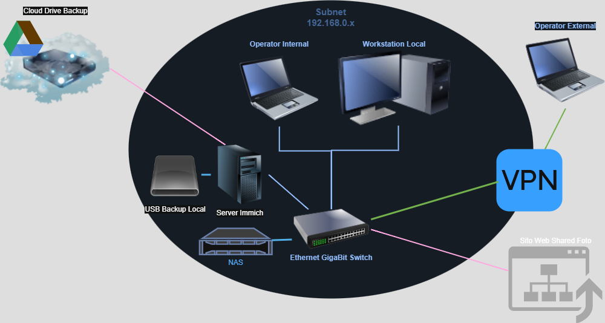

# Design del nuovo sito CRI Lazio

Appunti sulla struttura del sito web del comitato regionale CRI Lazio

- [ ] Todo: Analizzare l'accessibilità (non vedenti, ipovedenti, ...)
- [ ] Todo: Verificare cosa è stato fatto e promesso nel 2021 sull'accessibilità
- [ ] Todo: Installazione TrueNAS, Immich, Copia su disco locale, Copia su Cloud, Selezione su Web
- [ ] Todo: Condividere SiteMap
- [ ] Todo: Area o meglio sito per servizi a comitati e volontari

## WEB CONTENT STRATEGIST

- Revisione grafica e contenutistica del sito del Comitato Regionale Lazio, favorendo l’interazione con gli utenti e garantendo la chiarezza delle informazioni (possibilità di accesso al sito per non vedenti e ….?!?!?)
- Armonizzazione del sistema informatico e adozione di strumenti per la gestione dei dati in tempo reale, per operare in maniera più agile, trasparente ed efficiente.
- Creazione di un database centralizzato (INTRANET) con tutte le comunicazioni e normative aggiornate, come punto di riferimento uniforme per tutte le strutture territoriali.
- Archivio fotografico INTRANET e Cloud
- Promozione dell’alfabetizzazione informatica verso i volontari della regione, come strumento di inclusione digitale e potenziamento delle competenze interne.

## Schema Hw

