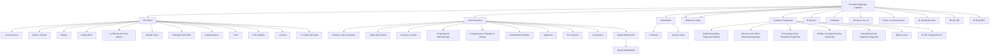

# Calabria Mermaid Diagram

```mermaid
graph TD
    A[Comitato Regionale Calabria]

    A --> B[Chi Siamo]
    B --> B1[L'Associazione]
    B --> B2[Storia e Principi]
    B --> B3[Statuto]
    B --> B4[Codice Etico]
    B --> B5[La Riforma del Terzo Settore]
    B --> B6[Identità Visiva]
    B --> B7[Strategia 2018-2030]
    B --> B8[Organizzazione]
    B --> B9[I Soci]
    B --> B10[Il CR Calabria]
    B --> B11[La Sede]
    B --> B12[I Comitati Territoriali]

    A --> C[Cosa Facciamo]
    C --> C1[Principi e Valori Umanitari]
    C --> C2[Tutela della Salute]
    C --> C3[Inclusione Sociale]
    C --> C4[Cooperazione Internazionale]
    C --> C5[Preparazione e Risposta ai Disastri]
    C --> C6[Cambiamenti Climatici]
    C --> C7[Migrazioni]
    C --> C8[Per i Giovani]
    C --> C9[Formazione]
    C --> C10[Report Attività 2021]
    C10 --> C11[Report Attività 2020]

    A --> D[Volontariato]
    D --> D1[I Volontari]
    D --> D2[Servizio Civile]

    A --> E[✚ Sostienici]
    A --> E[✚ Numero Verde]

    A --> F[Comitato Trasparente]
    F --> F1[Verbali Assemblee Regionali Calabria]
    F --> F2[Elezioni e Atti Ufficio Elettorale Regionale]
    F --> F3[Provvedimenti del Presidente Regionale]
    F --> F4[Delibere Consiglio Direttivo Regionale]
    F --> F5[Provvedimenti del Segretario Regionale]
    F --> F6[Bandi e Gare]
    F --> F7[✚ CRI Trasparente CN]

    A --> G[✚ Ricerca]

    A --> H[Contattaci]
    A --> I[✚ Lavora con noi]
    A --> J[Eventi e Comunicazione]
    A --> K[✚ Gestionale Gaia]
    A --> L[✚ Link Utili]
    A --> M[✚ Feed RSS]
```
