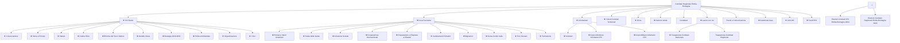

# Emilia Romagna Mermaid Diagram

```mermaid
graph TD
    A[Comitato Regionale Emilia-Romagna]

    A --> B[✚ Chi Siamo]
    B --> B1[✚ L’Associazione]
    B --> B2[✚ Storia e Principi]
    B --> B3[✚ Statuto]
    B --> B4[✚ Codice Etico]
    B --> B5[✚ Riforma del Terzo Settore]
    B --> B6[✚ Identità Visiva]
    B --> B7[✚ Strategia 2018-2030]
    B --> B8[✚ Politica Ambientale]
    B --> B9[✚ Organizzazione]
    B --> B10[✚ I Soci]

    A --> C[✚ Cosa Facciamo]
    C --> C1[✚ Principi e Valori Umanitari]
    C --> C2[✚ Tutela della Salute]
    C --> C3[✚ Inclusione Sociale]
    C --> C4[✚ Cooperazione Internazionale]
    C --> C5[✚ Preparazione e Risposta ai Disastri]
    C --> C6[✚ Cambiamenti Climatici]
    C --> C7[✚ Migrazioni]
    C --> C8[✚ Sisma Centro Italia]
    C --> C9[✚ Per i Giovani]
    C --> C10[✚ Formazione]

    A --> D[✚ Volontariato]
    D --> D1[✚ Volontari]
    D --> D2[✚ Corpo Infermiere Volontarie CRI]
    D --> D3[✚ Corpo Militare Volontario CRI]

    A --> E[✚ I Nostri Comitati Territoriali]
    A --> F[✚ Dona]
    A --> G[✚ Numero Verde]

    A --> H[Contattaci]
    A --> I[✚ Lavora con noi]

    I --> L[✚ Trasparenza Comitato Nazionale]
    I --> M[Trasparenza Comitato Regionale]
    J --> N[Elezioni Comitati CRI Emilia-Romagna 2024]
    J --> O[Elezioni Comitato Regionale Emilia-Romagna 2024]
    A --> P[Eventi e Comunicazione]
    A --> Q[✚ Gestionale Gaia]
    A --> R[✚ Link Utili]
    A --> S[✚ Feed RSS]
```
