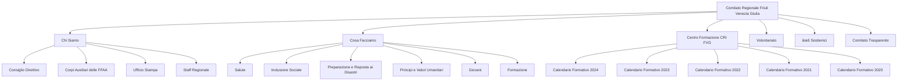

# Friuli Venezia Giulia Mermaid Diagram

```mermaid
graph TD
    A[Comitato Regionale Friuli Venezia Giulia]

    A --> B[Chi Siamo]
    B --> B1[Consiglio Direttivo]
    B --> B2[Corpi Ausiliari delle FFAA]
    B --> B3[Ufficio Stampa]
    B --> B4[Staff Regionale]

    A --> C[Cosa Facciamo]
    C --> C1[Salute]
    C --> C2[Inclusione Sociale]
    C --> C3[Preparazione e Risposta ai Disastri]
    C --> C4[Principi e Valori Umanitari]
    C --> C5[Giovani]
    C --> C6[Formazione]

    A --> D[Centro Formazione CRI FVG]
    D --> D1[Calendario Formativo 2024]
    D --> D2[Calendario Formativo 2023]
    D --> D3[Calendario Formativo 2022]
    D --> D4[Calendario Formativo 2021]
    D --> D5[Calendario Formativo 2020]

    A --> E[Volontariato]
    A --> F[✚ Sostienici]
    A --> G[Comitato Trasparente]
```
