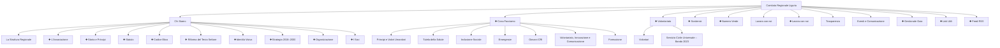

# Liguria Mermaid Diagram

[Home](/struttura_sito.md)

```mermaid
graph TD
    A[Comitato Regionale Liguria]

    A --> B[Chi Siamo]
    B --> B1[La Struttura Regionale]
    B --> B2[✚ L’Associazione]
    B --> B3[✚ Storia e Principi]
    B --> B4[✚ Statuto]
    B --> B5[✚ Codice Etico]
    B --> B6[✚ Riforma del Terzo Settore]
    B --> B7[✚ Identità Visiva]
    B --> B8[✚ Strategia 2018–2030]
    B --> B9[✚ Organizzazione]
    B --> B10[✚ I Soci]

    A --> C[✚ Cosa Facciamo]
    C --> C1[Principi e Valori Umanitari]
    C --> C2[Tutela della Salute]
    C --> C3[Inclusione Sociale]
    C --> C4[Emergenze]
    C --> C5[Giovani CRI]
    C --> C6[Volontariato, Innovazione e Comunicazione]
    C --> C7[Formazione]
    A --> D[✚ Volontariato]
    D --> D1[Volontari]
    D --> D2[Servizio Civile Universale – Bando 2023]
    A --> E[✚ Sostienici]
    A --> F[✚ Numero Verde]

    A --> G[Lavora con noi]
    A --> H[✚ Lavora con noi]
    A --> I[Trasparenza]
    A --> J[Eventi e Comunicazione]
    A --> K[✚ Gestionale Gaia]
    A --> L[✚ Link Utili]
    A --> M[✚ Feed RSS]
```
