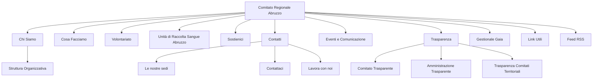
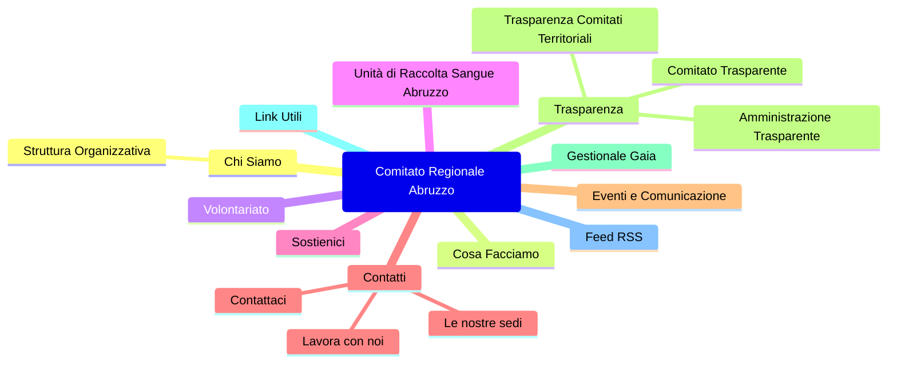

# Abruzzo Mermaid Diagram

[Home](/struttura_sito.md)

```mermaid
graph TD
    A[Comitato Regionale Abruzzo]

    A --> B[Chi Siamo]
    B --> B1[Struttura Organizzativa]

    A --> C[Cosa Facciamo]

    A --> D[Volontariato]

    A --> E[Unità di Raccolta Sangue Abruzzo]

    A --> F[Sostienici]

    A --> H[Contatti]
    H --> H1[Le nostre sedi]
    H --> H2[Contattaci]
    H --> H3[Lavora con noi]

    A --> I[Eventi e Comunicazione]

    A --> J[Trasparenza]
    J --> J1[Comitato Trasparente]
    J --> J2[Amministrazione Trasparente]
    J --> J3[Trasparenza Comitati Territoriali]

    A --> K[Gestionale Gaia]

    A --> L[Link Utili]
    A --> M[Feed RSS]
```

```mermaid
mindmap
  root(Comitato Regionale Abruzzo)
    Chi Siamo
      Struttura Organizzativa
    Cosa Facciamo
    Volontariato
    Unità di Raccolta Sangue Abruzzo
    Sostienici
    Contatti
      Le nostre sedi
      Contattaci
      Lavora con noi
    Eventi e Comunicazione
    Trasparenza
      Comitato Trasparente
      Amministrazione Trasparente
      Trasparenza Comitati Territoriali
    Gestionale Gaia
    Link Utili
    Feed RSS
```
