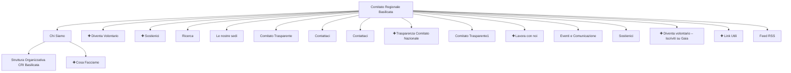
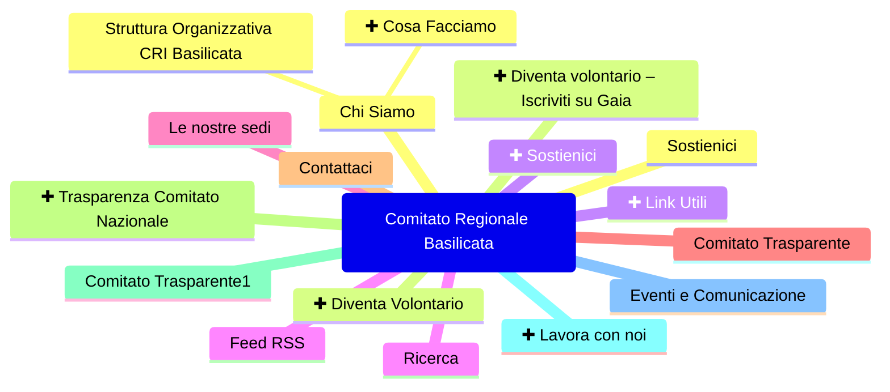

# Basilicata Mermaid Diagram

[Home](/struttura_sito.md)

```mermaid
graph TD
    A[Comitato Regionale Basilicata]

    A --> B[Chi Siamo]
    B --> B1[Struttura Organizzativa CRI Basilicata]
    B --> B2[✚ Cosa Facciamo]

    A --> C[✚ Diventa Volontario]

    A --> D[✚ Sostienici]

    A --> E[Ricerca]

    A --> F[Le nostre sedi]

    A --> G[Comitato Trasparente]

    A --> H[Contattaci]

    A --> I[Contattaci]
    A --> L[✚ Trasparenza Comitato Nazionale]
    A --> M[Comitato Trasparente1]
    A --> N[✚ Lavora con noi]
    A --> O[Eventi e Comunicazione]
    A --> P[Sostienici]
    A --> Q[✚ Diventa volontario – Iscriviti su Gaia]
    A --> R[✚ Link Utili]
    A --> S[Feed RSS]
```

```mermaid
mindmap
  root(Comitato Regionale Basilicata)
    Chi Siamo
      Struttura Organizzativa CRI Basilicata
      ✚ Cosa Facciamo
    ✚ Diventa Volontario
    ✚ Sostienici
    Ricerca
    Le nostre sedi
    Comitato Trasparente
    Contattaci
    ✚ Trasparenza Comitato Nazionale
    Comitato Trasparente1
    ✚ Lavora con noi
    Eventi e Comunicazione
    Sostienici
    ✚ Diventa volontario – Iscriviti su Gaia
    ✚ Link Utili
    Feed RSS
```
