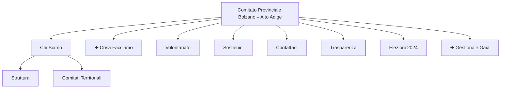
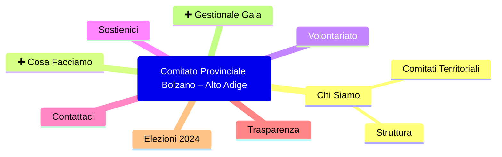

# Alto Adige - Bolzano Mermaid Diagram

## Sito esterno [https://www.crialtoadige.it/](https://www.crialtoadige.it/)

[Home](/struttura_sito.md)

```mermaid
graph TD
    A[Comitato Provinciale Bolzano – Alto Adige]

    A --> B[Chi Siamo]
    B --> B1[Struttura]
    B --> B2[Comitati Territoriali]

    A --> C[✚ Cosa Facciamo]

    A --> D[Volontariato]

    A --> E[Sostienici]

    A --> F[Contattaci]

    A --> G[Trasparenza]

    A --> H[Elezioni 2024]

    A --> I[✚ Gestionale Gaia]
```

```mermaid
mindmap
  root(Comitato Provinciale Bolzano – Alto Adige)
    Chi Siamo
      Struttura
      Comitati Territoriali
    ✚ Cosa Facciamo
    Volontariato
    Sostienici
    Contattaci
    Trasparenza
    Elezioni 2024
    ✚ Gestionale Gaia
```
