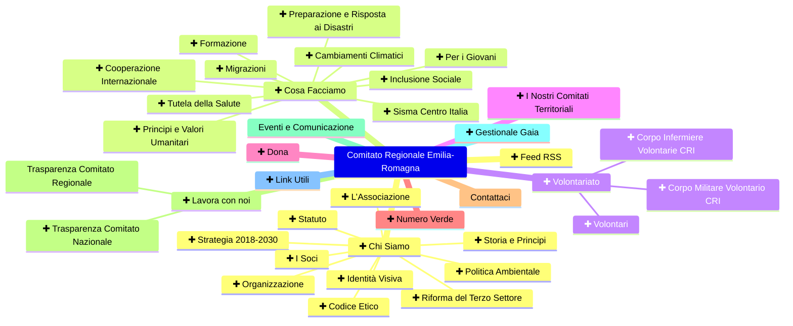

# Emilia Romagna Mermaid Diagram

[Home](/struttura_sito.md)

```mermaid
graph TD
    A[Comitato Regionale Emilia-Romagna]

    A --> B[✚ Chi Siamo]
    B --> B1[✚ L’Associazione]
    B --> B2[✚ Storia e Principi]
    B --> B3[✚ Statuto]
    B --> B4[✚ Codice Etico]
    B --> B5[✚ Riforma del Terzo Settore]
    B --> B6[✚ Identità Visiva]
    B --> B7[✚ Strategia 2018-2030]
    B --> B8[✚ Politica Ambientale]
    B --> B9[✚ Organizzazione]
    B --> B10[✚ I Soci]

    A --> C[✚ Cosa Facciamo]
    C --> C1[✚ Principi e Valori Umanitari]
    C --> C2[✚ Tutela della Salute]
    C --> C3[✚ Inclusione Sociale]
    C --> C4[✚ Cooperazione Internazionale]
    C --> C5[✚ Preparazione e Risposta ai Disastri]
    C --> C6[✚ Cambiamenti Climatici]
    C --> C7[✚ Migrazioni]
    C --> C8[✚ Sisma Centro Italia]
    C --> C9[✚ Per i Giovani]
    C --> C10[✚ Formazione]

    A --> D[✚ Volontariato]
    D --> D1[✚ Volontari]
    D --> D2[✚ Corpo Infermiere Volontarie CRI]
    D --> D3[✚ Corpo Militare Volontario CRI]

    A --> E[✚ I Nostri Comitati Territoriali]
    A --> F[✚ Dona]
    A --> G[✚ Numero Verde]

    A --> H[Contattaci]
    A --> I[✚ Lavora con noi]

    I --> L[✚ Trasparenza Comitato Nazionale]
    I --> M[Trasparenza Comitato Regionale]
    J --> N[Elezioni Comitati CRI Emilia-Romagna 2024]
    J --> O[Elezioni Comitato Regionale Emilia-Romagna 2024]
    A --> P[Eventi e Comunicazione]
    A --> Q[✚ Gestionale Gaia]
    A --> R[✚ Link Utili]
    A --> S[✚ Feed RSS]
```

```mermaid
mindmap
Comitato Regionale Emilia-Romagna
    ✚ Chi Siamo
        ✚ L’Associazione
        ✚ Storia e Principi
        ✚ Statuto
        ✚ Codice Etico
        ✚ Riforma del Terzo Settore
        ✚ Identità Visiva
        ✚ Strategia 2018-2030
        ✚ Politica Ambientale
        ✚ Organizzazione
        ✚ I Soci
    ✚ Cosa Facciamo
        ✚ Principi e Valori Umanitari
        ✚ Tutela della Salute
        ✚ Inclusione Sociale
        ✚ Cooperazione Internazionale
        ✚ Preparazione e Risposta ai Disastri
        ✚ Cambiamenti Climatici
        ✚ Migrazioni
        ✚ Sisma Centro Italia
        ✚ Per i Giovani
        ✚ Formazione
    ✚ Volontariato
        ✚ Volontari
        ✚ Corpo Infermiere Volontarie CRI
        ✚ Corpo Militare Volontario CRI
    ✚ I Nostri Comitati Territoriali
    ✚ Dona
    ✚ Numero Verde
    Contattaci
    ✚ Lavora con noi
        ✚ Trasparenza Comitato Nazionale
        Trasparenza Comitato Regionale
    Eventi e Comunicazione
    ✚ Gestionale Gaia
    ✚ Link Utili
    ✚ Feed RSS
```
