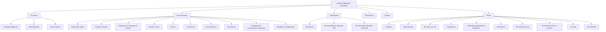

# Lombardia Mermaid Diagram

[Home](/struttura_sito.md)

```mermaid
graph TD
    A[Comitato Regionale Lombardia]

    A --> B[Chi Siamo]
    B --> B1[Consiglio Regionale]
    B --> B2[Staff Regionale]
    B --> B3[Ufficio Stampa]

    A --> C[Cosa Facciamo]
    C --> C1[Tutela della Salute]
    C --> C2[Inclusione Sociale]
    C --> C3[Preparazione e Risposta ai Disastri]
    C --> C4[Principi e Valori]
    C --> C5[Giovani]
    C --> C6[Formazione]
    C --> C7[Comunicazione]
    C --> C8[Innovazione]
    C --> C9[Cooperazione Internazionale, Migrazioni]
    C --> C10[Resilienza e Adattamento]

    A --> D[Volontariato]
    D --> D1[✚ Volontari]
    D --> D2[✚ Corpo Militare Volontario CRI]
    D --> D3[✚ Corpo delle Infermiere Volontarie]

    A --> E[✚ Sostienici]

    A --> F[Contatti]

    A --> G[Footer]

    G --> G1[Contattaci]
    G --> G2[Ufficio Stampa]
    G --> G3[✚ Lavora con noi]
    G --> G4[Trasparenza]
    G --> G5[Calendario Appuntamenti Regionale]
    G --> G6[✚ Sostienici]
    G --> G7[✚ Gestionale Gaia]
    G --> G8[✚ Gestionale “Per le persone”]
    G --> G9[Link Utili]
    G --> G10[✚ Feed RSS]
```
