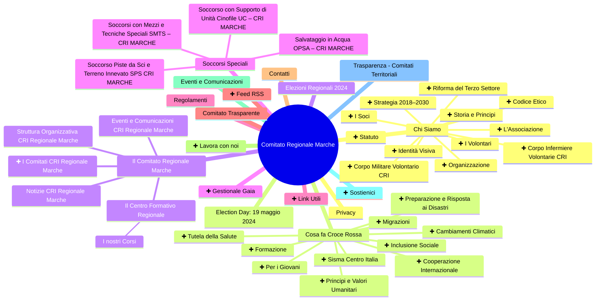

# Marche Mermaid Diagram

[Home](/struttura_sito.md)

```mermaid
graph TD
    A[Comitato Regionale Marche]

    A --> B[Chi Siamo]
    B --> B1[✚ L’Associazione]
    B --> B2[✚ Storia e Principi]
    B --> B3[✚ Statuto]
    B --> B4[✚ Codice Etico]
    B --> B5[✚ Riforma del Terzo Settore]
    B --> B6[✚ Identità Visiva]
    B --> B7[✚ Strategia 2018–2030]
    B --> B8[✚ Organizzazione]
    B --> B9[✚ I Soci]
    B --> B10[✚ I Volontari]
    B --> B11[✚ Corpo Militare Volontario CRI]
    B --> B12[✚ Corpo Infermiere Volontarie CRI]
    A --> C[Cosa fa Croce Rossa]
    C --> C1[✚ Principi e Valori Umanitari]
    C --> C2[✚ Tutela della Salute]
    C --> C3[✚ Inclusione Sociale]
    C --> C4[✚ Cooperazione Internazionale]
    C --> C5[✚ Preparazione e Risposta ai Disastri]
    C --> C6[✚ Cambiamenti Climatici]
    C --> C7[✚ Migrazioni]
    C --> C8[✚ Sisma Centro Italia]
    C --> C9[✚ Per i Giovani]
    C --> C10[✚ Formazione]

    A --> D[Il Comitato Regionale Marche]
    D --> D1[Struttura Organizzativa CRI Regionale Marche]
    D --> D2[✚ I Comitati CRI Regionale Marche]
    D --> D3[Il Centro Formativo Regionale]
    D3 --> D3a[I nostri Corsi]
    D --> D4[Notizie CRI Regionale Marche]
    D --> D5[Eventi e Comunicazioni CRI Regionale Marche]

    A --> E[Soccorsi Speciali]
    E --> E1[Salvataggio in Acqua OPSA – CRI MARCHE]
    E --> E2[Soccorso Piste da Sci e Terreno Innevato SPS CRI MARCHE]
    E --> E3[Soccorsi con Mezzi e Tecniche Speciali SMTS – CRI MARCHE]
    E --> E4[Soccorso con Supporto di Unità Cinofile UC – CRI MARCHE]

    A --> F[Regolamenti]
    A --> G[Comitato Trasparente]

    A --> H[Contatti]
    A --> J[✚ Lavora con noi]
    A --> K[Eventi e Comunicazioni]
    A --> L[✚ Sostienici]
    A --> M[Trasparenza - Comitati Territoriali]
    A --> N[Privacy]
    A --> 0[Election Day: 19 maggio 2024]
    A --> P[Elezioni Regionali 2024]     
    A --> Q[✚ Gestionale Gaia]
    A --> R[✚ Link Utili]
    A --> S[✚ Feed RSS]
```

```mermaid
mindmap
  root((Comitato Regionale Marche))
    Chi Siamo
      ✚ L'Associazione
      ✚ Storia e Principi
      ✚ Statuto
      ✚ Codice Etico
      ✚ Riforma del Terzo Settore
      ✚ Identità Visiva
      ✚ Strategia 2018–2030
      ✚ Organizzazione
      ✚ I Soci
      ✚ I Volontari
      ✚ Corpo Militare Volontario CRI
      ✚ Corpo Infermiere Volontarie CRI
    Cosa fa Croce Rossa
      ✚ Principi e Valori Umanitari
      ✚ Tutela della Salute
      ✚ Inclusione Sociale
      ✚ Cooperazione Internazionale
      ✚ Preparazione e Risposta ai Disastri
      ✚ Cambiamenti Climatici
      ✚ Migrazioni
      ✚ Sisma Centro Italia
      ✚ Per i Giovani
      ✚ Formazione
    Il Comitato Regionale Marche
      Struttura Organizzativa CRI Regionale Marche
      ✚ I Comitati CRI Regionale Marche
      Il Centro Formativo Regionale
        I nostri Corsi
      Notizie CRI Regionale Marche
      Eventi e Comunicazioni CRI Regionale Marche
    Soccorsi Speciali
      Salvataggio in Acqua OPSA – CRI MARCHE
      Soccorso Piste da Sci e Terreno Innevato SPS CRI MARCHE
      Soccorsi con Mezzi e Tecniche Speciali SMTS – CRI MARCHE
      Soccorso con Supporto di Unità Cinofile UC – CRI MARCHE
    Regolamenti
    Comitato Trasparente
    Contatti
    ✚ Lavora con noi
    Eventi e Comunicazioni
    ✚ Sostienici
    Trasparenza - Comitati Territoriali
    Privacy
    Election Day: 19 maggio 2024
    Elezioni Regionali 2024
    ✚ Gestionale Gaia
    ✚ Link Utili
    ✚ Feed RSS
```
