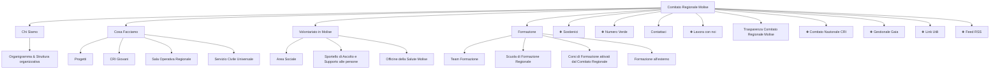

# Molise Mermaid Diagram

[Home](/struttura_sito.md)

```mermaid
graph TD
    A[Comitato Regionale Molise]

    A --> B[Chi Siamo]
    B --> B1[Organigramma & Struttura organizzativa]

    A --> C[Cosa Facciamo]
    C --> C1[Progetti]
    C --> C2[CRI Giovani]
    C --> C3[Sala Operativa Regionale]
    C --> C4[Servizio Civile Universale]

    A --> D[Volontariato in Molise]
    D --> D1[Area Sociale]
    D --> D2[Sportello di Ascolto e Supporto alle persone]
    D --> D3[Officine della Salute Molise]

    A --> E[Formazione]
    E --> E1[Team Formazione]
    E --> E2[Scuola di Formazione Regionale]
    E --> E3[Corsi di Formazione attivati dal Comitato Regionale]
    E --> E4[Formazione all’esterno]

    A --> F[✚ Sostienici]
    A --> G[✚ Numero Verde]

    A --> H[Contattaci]
    A --> I[✚ Lavora con noi]
    A --> J[Trasparenza Comitato Regionale Molise]
    A --> K[✚ Comitato Nazionale CRI]
    A --> L[✚ Gestionale Gaia]
    A --> M[✚ Link Utili]
    A --> N[✚ Feed RSS]
```
