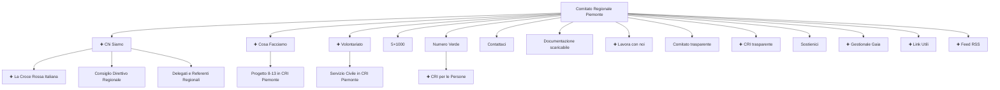
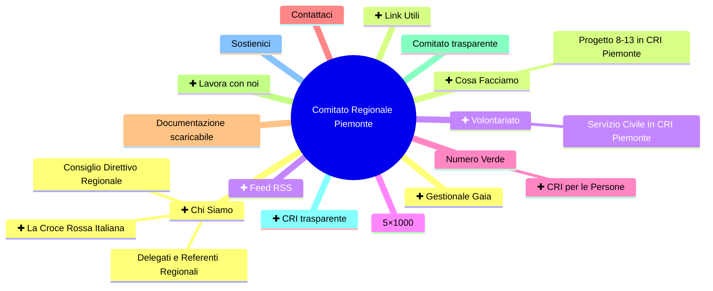

# Piemonte Mermaid Diagram

[Home](/struttura_sito.md)

```mermaid
graph TD
    A[Comitato Regionale Piemonte]

    A --> B[✚ Chi Siamo]
    B --> B1[✚ La Croce Rossa Italiana]
    B --> B2[Consiglio Direttivo Regionale]
    B --> B3[Delegati e Referenti Regionali]

    A --> C[✚ Cosa Facciamo]
    C --> C1[Progetto 8-13 in CRI Piemonte]

    A --> D[✚ Volontariato]
    D --> D1[Servizio Civile in CRI Piemonte]

    A --> E[5×1000]

    A --> G[Numero Verde]
    G --> G1[✚ CRI per le Persone]

    A --> H[Contattaci]
    A --> I[Documentazione scaricabile]
    A --> J[✚ Lavora con noi]
    A --> K[Comitato trasparente]
    A --> L[✚ CRI trasparente]
    A --> ML[Sostienici]
    A --> N[✚ Gestionale Gaia]
    A --> O[✚ Link Utili]
    A --> P[✚ Feed RSS]
```

```mermaid
mindmap
  root((Comitato Regionale Piemonte))
    ✚ Chi Siamo
      ✚ La Croce Rossa Italiana
      Consiglio Direttivo Regionale
      Delegati e Referenti Regionali
    ✚ Cosa Facciamo
      Progetto 8-13 in CRI Piemonte
    ✚ Volontariato
      Servizio Civile in CRI Piemonte
    5×1000
    Numero Verde
      ✚ CRI per le Persone
    Contattaci
    Documentazione scaricabile
    ✚ Lavora con noi
    Comitato trasparente
    ✚ CRI trasparente
    Sostienici
    ✚ Gestionale Gaia
    ✚ Link Utili
    ✚ Feed RSS
```
