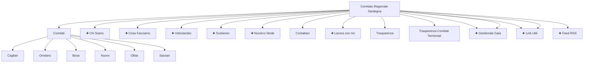
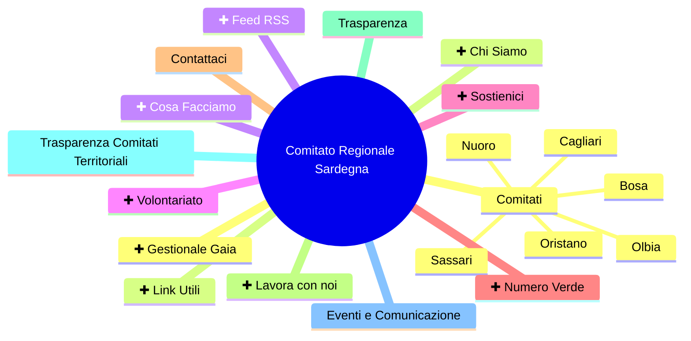

# Sardegna Mermaid Diagram

[Home](/struttura_sito.md)

```mermaid
graph TD
    A[Comitato Regionale Sardegna]

    A --> B[Comitati]
    B --> B1[Cagliari]
    B --> B2[Oristano]
    B --> B3[Bosa]
    B --> B4[Nuoro]
    B --> B5[Olbia]
    B --> B6[Sassari]

    A --> C[✚ Chi Siamo]

    A --> D[✚ Cosa Facciamo]

    A --> E[✚ Volontariato]

    A --> F[✚ Sostienici]

    A --> G[✚ Numero Verde]

    A --> H[Contattaci]

    A --> I[✚ Lavora con noi]

    A --> J[Trasparenza]

    A --> K[Trasparenza Comitati Territoriali]

    A --> L[Eventi e Comunicazione]
    
    A --> M[✚ Sostienici]

    A --> L[✚ Gestionale Gaia]

    A --> M[✚ Link Utili]

    A --> N[✚ Feed RSS]
```

```mermaid
mindmap
  root((Comitato Regionale Sardegna))
    Comitati
      Cagliari
      Oristano
      Bosa
      Nuoro
      Olbia
      Sassari
    ✚ Chi Siamo
    ✚ Cosa Facciamo
    ✚ Volontariato
    ✚ Sostienici
    ✚ Numero Verde
    Contattaci
    ✚ Lavora con noi
    Trasparenza
    Trasparenza Comitati Territoriali
    Eventi e Comunicazione
    ✚ Gestionale Gaia
    ✚ Link Utili
    ✚ Feed RSS
```
