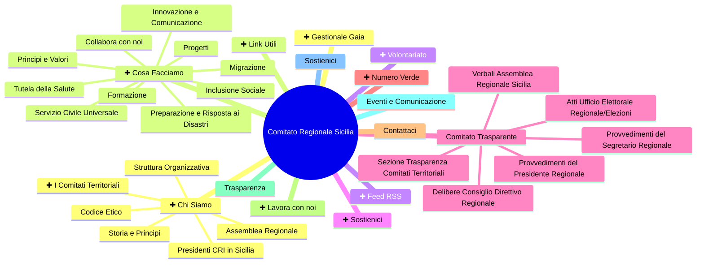

# Sicilia Mermaid Diagram

[Home](/struttura_sito.md)

```mermaid
graph TD
    A[Comitato Regionale Sicilia]

    A --> B[✚ Chi Siamo]
    B --> B1[Codice Etico]
    B --> B2[Storia e Principi]
    B --> B3[Struttura Organizzativa]
    B --> B4[Presidenti CRI in Sicilia]
    B --> B5[Assemblea Regionale]
    B --> B6[✚ I Comitati Territoriali]

    A --> C[✚ Cosa Facciamo]
    C --> C1[Tutela della Salute]
    C --> C2[Preparazione e Risposta ai Disastri]
    C --> C3[Inclusione Sociale]
    C --> C4[Principi e Valori]
    C --> C5[Migrazione]
    C --> C6[Formazione]
    C --> C7[Innovazione e Comunicazione]
    C --> C8[Servizio Civile Universale]
    C --> C9[Progetti]
    C --> C10[Collabora con noi]

    A --> D[✚ Volontariato]
    
    A --> E[✚ Sostienici]

    A --> F[Comitato Trasparente]
    F --> F1[Verbali Assemblea Regionale Sicilia]
    F --> F2[Atti Ufficio Elettorale Regionale/Elezioni]
    F --> F3[Provvedimenti del Presidente Regionale]
    F --> F4[Provvedimenti del Segretario Regionale]
    F --> F5[Delibere Consiglio Direttivo Regionale]
    F --> F6[Sezione Trasparenza Comitati Territoriali]

    A --> G[✚ Numero Verde]

    A --> H[Contattaci]
    A --> I[✚ Lavora con noi]
    A --> J[Trasparenza]
    A --> K[Eventi e Comunicazione]
    A --> L[Sostienici]
    A --> M[✚ Gestionale Gaia]
    A --> N[✚ Link Utili]
    A --> O[✚ Feed RSS]
```

```mermaid
mindmap
  root((Comitato Regionale Sicilia))
    ✚ Chi Siamo
      Codice Etico
      Storia e Principi
      Struttura Organizzativa
      Presidenti CRI in Sicilia
      Assemblea Regionale
      ✚ I Comitati Territoriali
    ✚ Cosa Facciamo
      Tutela della Salute
      Preparazione e Risposta ai Disastri
      Inclusione Sociale
      Principi e Valori
      Migrazione
      Formazione
      Innovazione e Comunicazione
      Servizio Civile Universale
      Progetti
      Collabora con noi
    ✚ Volontariato
    ✚ Sostienici
    Comitato Trasparente
      Verbali Assemblea Regionale Sicilia
      Atti Ufficio Elettorale Regionale/Elezioni
      Provvedimenti del Presidente Regionale
      Provvedimenti del Segretario Regionale
      Delibere Consiglio Direttivo Regionale
      Sezione Trasparenza Comitati Territoriali
    ✚ Numero Verde
    Contattaci
    ✚ Lavora con noi
    Trasparenza
    Eventi e Comunicazione
    Sostienici
    ✚ Gestionale Gaia
    ✚ Link Utili
    ✚ Feed RSS
```
