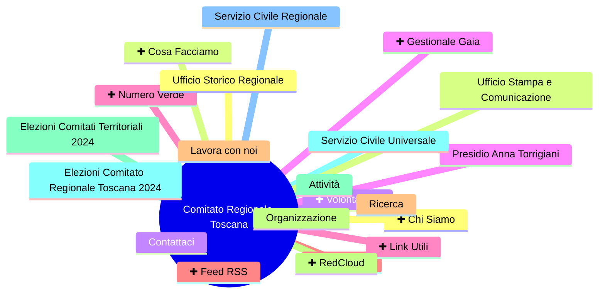

# Toscana Mermaid Diagram

[Home](/struttura_sito.md)

```mermaid
graph TD
    A[Comitato Regionale Toscana]

    A --> B[✚ Chi Siamo]
    A --> C[✚ Cosa Facciamo]
    A --> D[✚ Volontariato]
    A --> E[Presidio Anna Torrigiani]

    A --> F[✚ Numero Verde]

    A --> G[✚ Sostienici]

    A --> H[Ricerca]

    A --> I[Organizzazione]
    A --> J[Attività]
    A --> K[Servizio Civile Universale]
    A --> L[Servizio Civile Regionale]
    A --> M[Ufficio Storico Regionale]
    A --> N[Ufficio Stampa e Comunicazione]

    A --> O[Contattaci]
    A --> P[✚ Gestionale Gaia]
    A --> Q[✚ Link Utili]
    A --> R[✚ Feed RSS]
    A --> S[Lavora con noi] 
    A --> T[✚ RedCloud]
    A --> U[Elezioni Comitati Territoriali 2024]
    A --> V[Elezioni Comitato Regionale Toscana 2024]
```

```mermaid
mindmap
  root((Comitato Regionale Toscana))
    ✚ Chi Siamo
    ✚ Cosa Facciamo
    ✚ Volontariato
    Presidio Anna Torrigiani
    ✚ Numero Verde
    ✚ Sostienici
    Ricerca
    Organizzazione
    Attività
    Servizio Civile Universale
    Servizio Civile Regionale
    Ufficio Storico Regionale
    Ufficio Stampa e Comunicazione
    Contattaci
    ✚ Gestionale Gaia
    ✚ Link Utili
    ✚ Feed RSS
    Lavora con noi
    ✚ RedCloud
    Elezioni Comitati Territoriali 2024
    Elezioni Comitato Regionale Toscana 2024
```
