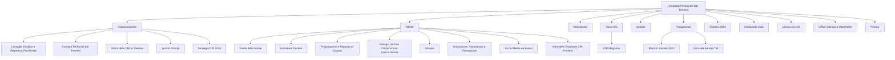

# Trentino Mermaid Diagram
✚ 
[Home](/struttura_sito.md)

```mermaid
graph TD
    A[Comitato Provinciale del Trentino]

    A --> B[Organizzazione]
    B --> B1[Consiglio Direttivo e Segretario Provinciale]
    B --> B2[Comitati Territoriali del Trentino]
    B --> B3[Storia della CRI in Trentino]
    B --> B4[I nostri Principi]
    B --> B5[Strategia CRI 2030]

    A --> C[Attività]
    C --> C1[Tutela della Salute]
    C --> C2[Inclusione Sociale]
    C --> C3[Preparazione e Risposta ai Disastri]
    C --> C4[Principi, Valori e Cooperazione Internazionale]
    C --> C5[Giovani]
    C --> C6[Innovazione, Volontariato e Formazione]
    C --> C7[Social Media ed Eventi]
    C --> C8[Infermiere Volontarie CRI Trentino]

    A --> D[Volontariato]

    A --> E[Dona Ora]
    E --> E1[CRI Magazine]

    A --> F[Contatti]

    A --> G[Trasparenza]
    G --> G1[Bilancio Sociale 2023]
    G --> G2[Carta dei Servizi CRI]

    A --> H[Elezioni 2024]

    A --> I[Gestionale Gaia]

    A --> J[Lavora con noi]

    A --> K[Ufficio Stampa e Multimedia]

    A --> L[Privacy]
```
