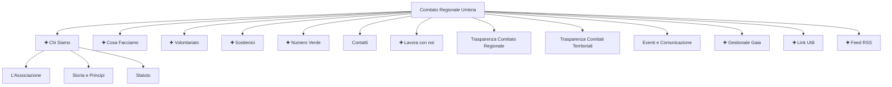
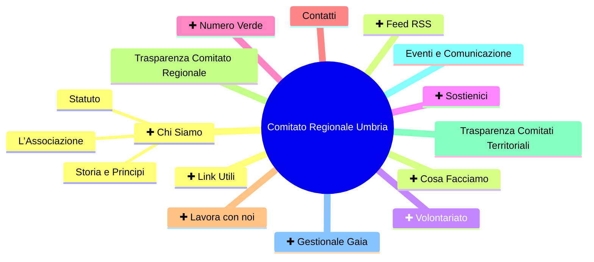

# Umbria Mermaid Diagram

[Home](/struttura_sito.md)

```mermaid
graph TD
    A[Comitato Regionale Umbria]

    A --> B[✚ Chi Siamo]
    B --> B1[L’Associazione]
    B --> B2[Storia e Principi]
    B --> B3[Statuto]

    A --> C[✚ Cosa Facciamo]

    A --> D[✚ Volontariato]

    A --> E[✚ Sostienici]

    A --> F[✚ Numero Verde]

    A --> G[Contatti]

    A --> H[✚ Lavora con noi]

    A --> I[Trasparenza Comitato Regionale]

    A --> J[Trasparenza Comitati Territoriali]

    A --> K[Eventi e Comunicazione]

    A --> L[✚ Gestionale Gaia]

    A --> M[✚ Link Utili]

    A --> N[✚ Feed RSS]
```

```mermaid
mindmap
  root((Comitato Regionale Umbria))
    ✚ Chi Siamo
      L’Associazione
      Storia e Principi
      Statuto
    ✚ Cosa Facciamo
    ✚ Volontariato
    ✚ Sostienici
    ✚ Numero Verde
    Contatti
    ✚ Lavora con noi
    Trasparenza Comitato Regionale
    Trasparenza Comitati Territoriali
    Eventi e Comunicazione
    ✚ Gestionale Gaia
    ✚ Link Utili
    ✚ Feed RSS
```
