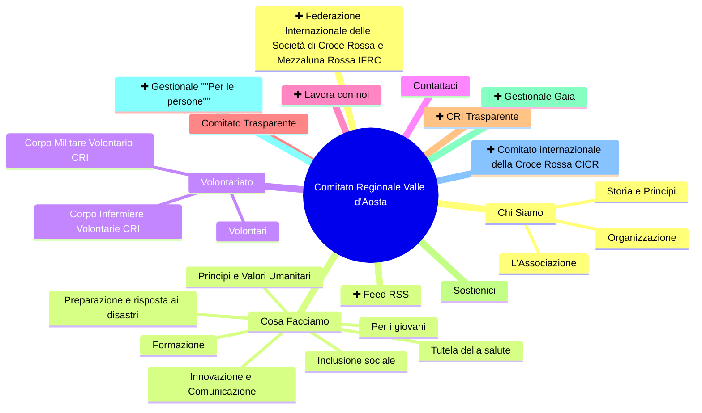

# Valle d'Aosta Mermaid Diagram

[Home](/struttura_sito.md)

```mermaid
graph TD
    A[Comitato Regionale Valle d'Aosta]

    A --> B[Chi Siamo]
    B --> B1[L’Associazione]
    B --> B2[Storia e Principi]
    B --> B3[Organizzazione]

    A --> C[Cosa Facciamo]
    C --> C1[Tutela della salute]
    C --> C2[Inclusione sociale]
    C --> C3[Preparazione e risposta ai disastri]
    C --> C4[Principi e Valori Umanitari]
    C --> C5[Per i giovani]
    C --> C6[Innovazione e Comunicazione]
    C --> C7[Formazione]

    A --> D[Volontariato]
    D --> D1[Volontari]
    D --> D2[Corpo Infermiere Volontarie CRI]
    D --> D3[Corpo Militare Volontario CRI]

    A --> F[Contattaci]

    A --> G[✚ Lavora con noi]

    A --> H[Comitato Trasparente]

    A --> I[✚ CRI Trasparente]

    A --> J[Sostienici]
    
    A --> K[✚ Gestionale Gaia]

    A --> L[✚ Gestionale ""Per le persone""]
    
    A --> M[✚ Comitato internazionale della Croce Rossa CICR]

    A --> N[✚ Federazione Internazionale delle Società di Croce Rossa e Mezzaluna Rossa IFRC]

    A --> O[✚ Feed RSS]
```

```mermaid
mindmap
  root((Comitato Regionale Valle d'Aosta))
    Chi Siamo
      L’Associazione
      Storia e Principi
      Organizzazione
    Cosa Facciamo
      Tutela della salute
      Inclusione sociale
      Preparazione e risposta ai disastri
      Principi e Valori Umanitari
      Per i giovani
      Innovazione e Comunicazione
      Formazione
    Volontariato
      Volontari
      Corpo Infermiere Volontarie CRI
      Corpo Militare Volontario CRI
    Contattaci
    ✚ Lavora con noi
    Comitato Trasparente
    ✚ CRI Trasparente
    Sostienici
    ✚ Gestionale Gaia
    ✚ Gestionale ""Per le persone""
    ✚ Comitato internazionale della Croce Rossa CICR
    ✚ Federazione Internazionale delle Società di Croce Rossa e Mezzaluna Rossa IFRC
    ✚ Feed RSS
```
